# 容器知识

---

有关容器的发展到Docker底层知识的梳理。

## 容器技术

---

容器技术:有效的将单个操作系统的资源划分到孤立的组中，以便更好的在孤立的组之间平衡有冲突的资源使用需求，这种技术就是容器技术。

### chroot

最开始就是为了隔离出来进程的运行的资源等，叫做jail，为了进程的安全运行。

*vserver* 最开始的实现的就是`chroot`就是切根，把当前目录当作主目录

### Namespaces

隔离需要的几个方面：

1. 主机名和域名(UTF)
2. 根文件系统(Mount)
3. 每一个用户空间都应该有(IPC进程间通信)
4. 进程树(PID)
5. 用户(User)
6. 网络(Net)

以上6种都可以在内核里面用名称空间进行隔离，通过系统调用来使用`Namespaces`进行隔离。

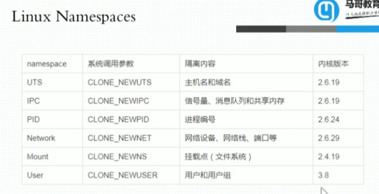

### Cgroups(Control Groups)

- *CPU资源分配*

CPU属于可压缩资源，如果没有可以挂起等待，可以弹性分配，按比例分配，也可以固定分配，几核就是几核。

- *内存资源分配*

内存属于不可压缩资源，必须指定分配，不能超出。

这个时候就应该使用内核级的*cgroups*来进行资源分配。

*cgroups*其实就是把系统资源分配到指定的*Control Groups*中。

将机器上运行的进程进行分类，分成各个组，每个组其实就可以和*Namespaces*进行绑定，一个*Namespaces*可以搞成一个组，然后进行资源分配。

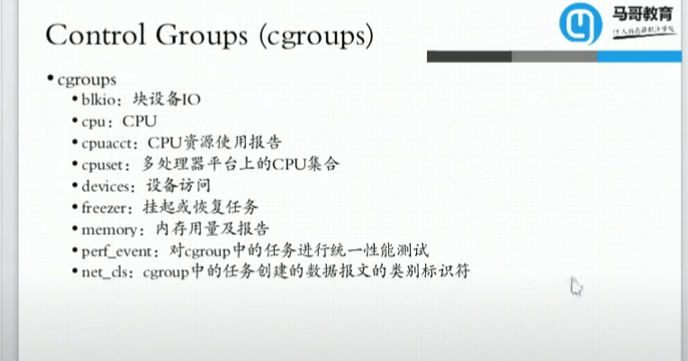

## LXC(LinuX Container)

---

把以上的容器技术进行整合的最早的一个建议使用的工具和模板。

### `lxc-create`

  创建一个*namespaces*, `template`就是一个模板，创建完之后就通过这个模板来完成你所需的安装过程，把所有你需要的软件从仓库进行拉取，通过这个创建出来的进程或者称为一个命名空间就是一个类似于虚拟机一样的东西，虽然隔离性没有虚拟机那么好，但是它的调用等不会有太多额外的开销，因为是通过内核来进行隔离，所以进程访问资源的时候也直接通过进程，而不是虚拟机那样提供过一层二进制翻译层来插入到内核的命令中。

  这个方法存在很大的缺陷，如果需要快速部署和搭建的时候没有一个统一的管理工具，没有办法进行数据的转移等功能。

## Docker

---

其实*Docker*可以理解为*LXC*的增强版。

早期的*Docker*其实就是*LXC*包裹了一层，只是使用了镜像的这种技术，将每个容器运行时所需要的环境进行打包，生成了镜像文件，然后放到了指定的镜像仓库中，当创建容器的时候就等于运行了`lxc-create`只是没有运行*template*那个脚本，然后把镜像直接拿过来运行就行。

而且*Docker*的思想更贴近于一个容器中运行一个应用程序(App)，而*LXC*中更像一个虚拟机一样，可以运行多个进程，比较而言的话*Docker*对于应用程序而言更容易管理，而不像*LXC*一样，每个都是一个虚拟机，每个都要去搞。

这样会使每个容器中有很多其他的相同的必要文件，所以它占用的空间比*LXC*要大。

*Docker*镜像是分层构建的，联合挂载的，每一层都是只读的，如果要操作其他层需要夹一层，所以一般都不会在容器内部存储持久化数据，而是挂载一个外部的持久化数据来存储。

*Docker*因为每个容器都只运行一个主的进程，有时候需要一些进程间的依赖的程序，比如就是软件依赖的程序，这个时候就需要容器编排技术了。

- machine+swarm+compose
  这个是*Docker*自己的容器编排技术

- mesos+marathon
  这个是Apache的容器编排技术

- kubernetes -> k8s
  现在主流的容器编排技术

后面*Docker*底层就不走*LXC*了，就用的*libcontainer* --> *runC* 变成了容器时运行标准。

- OCI

  Open Container Initiative
  一个2015年6月成立的基金会，为容器格式和运行时指定一个开放式的工业化标准。
  - Runtime Specifications 运行时标准(runtime-spec)
  - Image Specifications 镜像格式标准(image-spec)

- OCF

  Open Container Format
  开放的容器格式，runC就是这个里面主要的实现之一

### Docker 架构

整体架构是C/S架构程序，所有的命令都是docker client解析然后去请求docker daemon的。

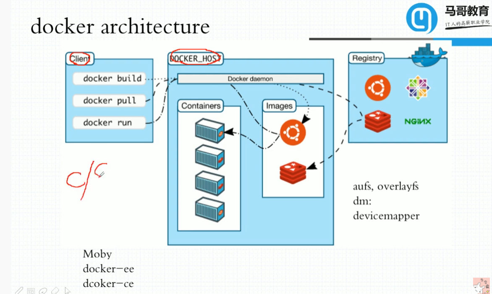

所有的应用层协议都是HTTP/HTTPS的，docker使用的*RESTFull*风格的*API*，下载Images的时候默认是HTTPS。

*Docker*的租成分为三部分：

1. *Docker Daemon*
2. *Docker Client*
3. *Docker Registry*

    每个仓库就是一个应用程序，然后每个版本都是不同的*tag*，根据*tag*不同，指定不同的镜像。每个镜像可以有多个*tag*。通过*tag*进行版本管理。

- alpine: 最小的版本

一般而言生产环境都是自己搭建仓库自己上传镜像

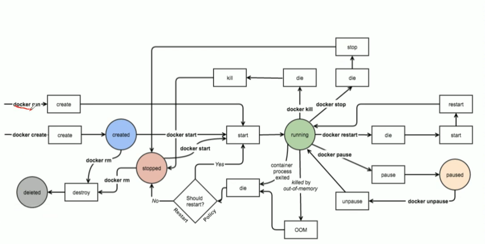

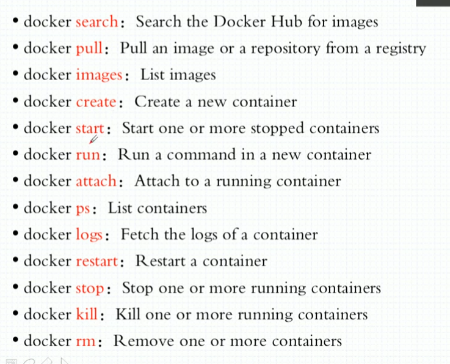

### Docker镜像

镜像存储在本地的特殊的存储系统里面，存储系统

- overlay2 1.18之后使用的文件系统

Docker镜像含有启动容器所需要的文件系统及其内容。

最底层的*bootfs*层在启动完毕后会自动卸载，就是从内存中卸载，写操作只有最上层的可写层，容器删除后就被删除。

docker必须使用特殊的文件系统来构建容器的。

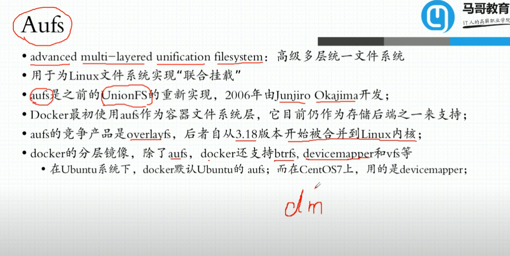
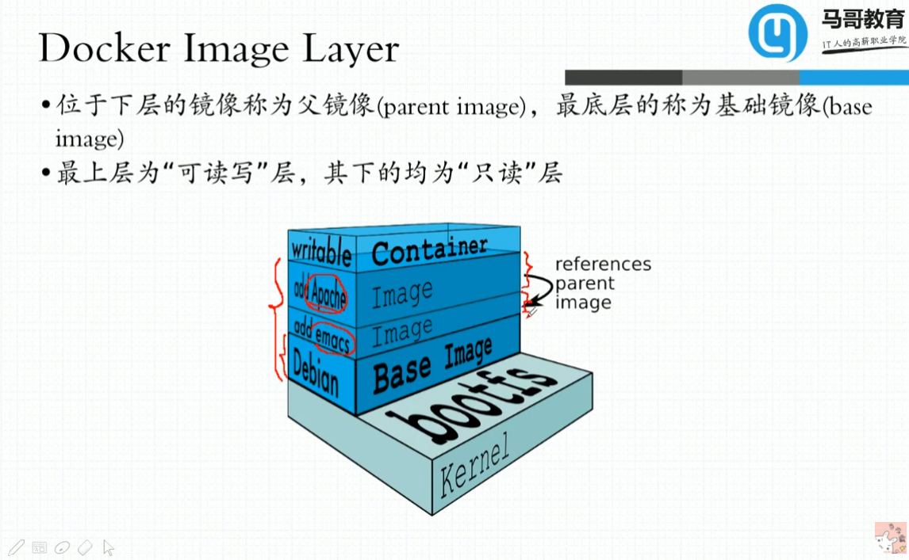
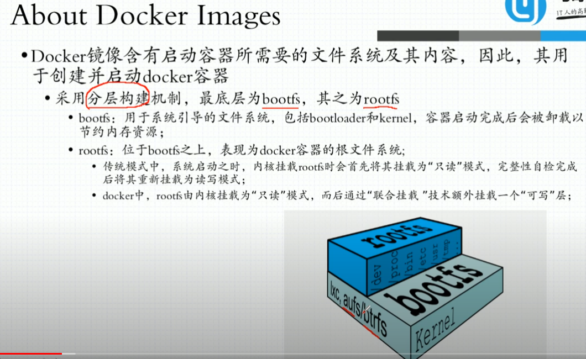

### Docker Registry分类

- Sponsor Registry: 第三方的registry,供客户和Docker社区使用。
- Mirror Registry: 第三方的registry,只让客户使用。
- Vendor Registry: 由发布Docker镜像的供应商提供的registry。
- Private Registry: 通过设有防火墙和额外的安全层的私有实体提供的registry。

开源的*Docker Registry*有个叫*harbor*的开源的仓库。

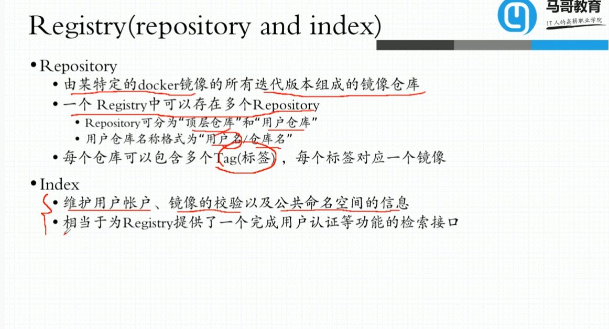

    云原生 就是各种配置通过环境变量传入配置，面向云平台进行编程。

### Docker Hub

镜像制作的方法

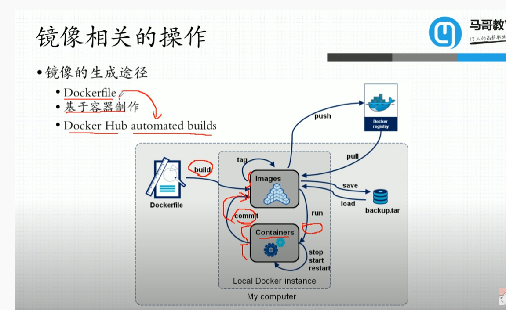

### Docker Networking

#### 桥接

虚拟网卡内核可以支持二层设备和三层设备

二层设备中可以直接内核模拟，他直接模拟了一个拥有两端的网卡，可以一端连接到我们用户中隔离出来的虚拟的网卡，一端连接到我们虚拟的一个交换机上面，这样就直接形成了一个bridge，brctl这种软件就可以模拟一个交换机

OVS：OpenVSwitch 模拟实现一个交换机。
SDN：软件定义或者软件驱动的网络。

网络地址爆炸。

#### NAT

直接把容器的网关设置为虚拟的交换机，然后两次NAT，最后一层物理网卡一层NAT，虚拟交换机一层NAT。

效率很低，网络容易管理。

#### Overlay Network(叠加网络)

通过报文的隧道转发，就是在原报文的基础上再封装一层或多层报文，来进行转发。

Docker的daemon启动了一个虚拟交换机，就是Docker0，每启动一个容器，就会创建一对儿网卡，一端在容器内，一端连接在Docker0的交换机上面。

工具 bridge-utils 桥接工具

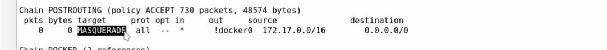

不管从哪个网卡进来的，只要不从docker0出的源地址属于172.17.0.0网段的数据包无论到达任何主机都要进行地址伪装，就是SNAT，所以DOCKER0桥默认是nat桥。

#### docker有4中网络模型

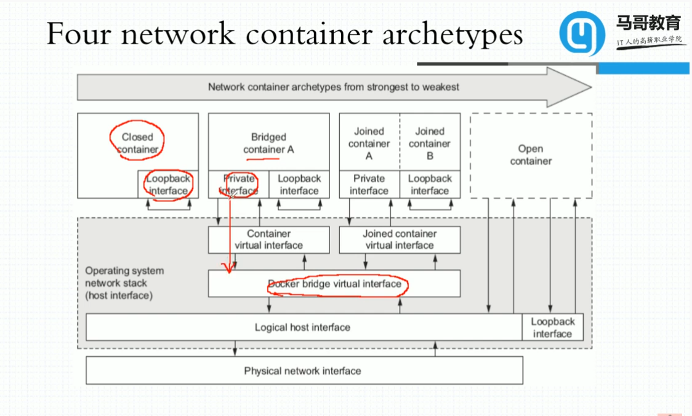

默认为第二种网络，桥接式，但是是nat桥。

*ip*命令就可以创建网络的命名空间，也可以通过*ip*创建虚拟网卡等。

对于容器而言，主机名就是id号，如果设置了就是具体的容器名。

#### docker暴露容器内端口

Opening inbound communication

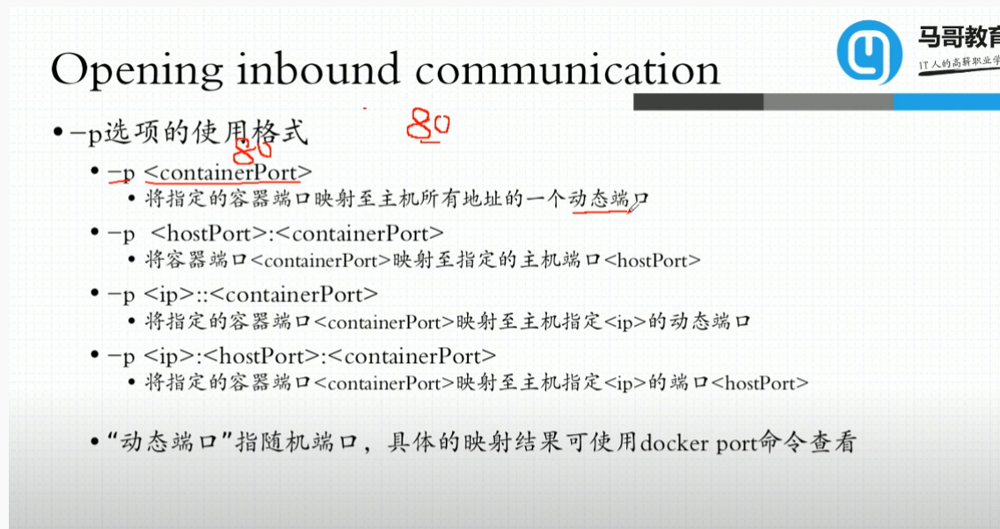

docker内部网络的话可以直接从宿主机的iptables里面看到，直接看网络规则就行。

也可以使用docker network 等命令查看。

### docker 存储卷

什么是data volumes?

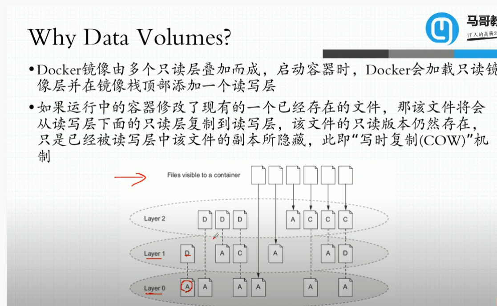

io性能消耗大。

就是将外部的目录或者文件与容器中的目录或者文件，建立一个绑定关系，就类似于一个挂载一样。

这个目录就被称之为*volume*。

所以这样就能实现*volume*上面的数据能够脱离容器的生命周期。

#### docker volume type

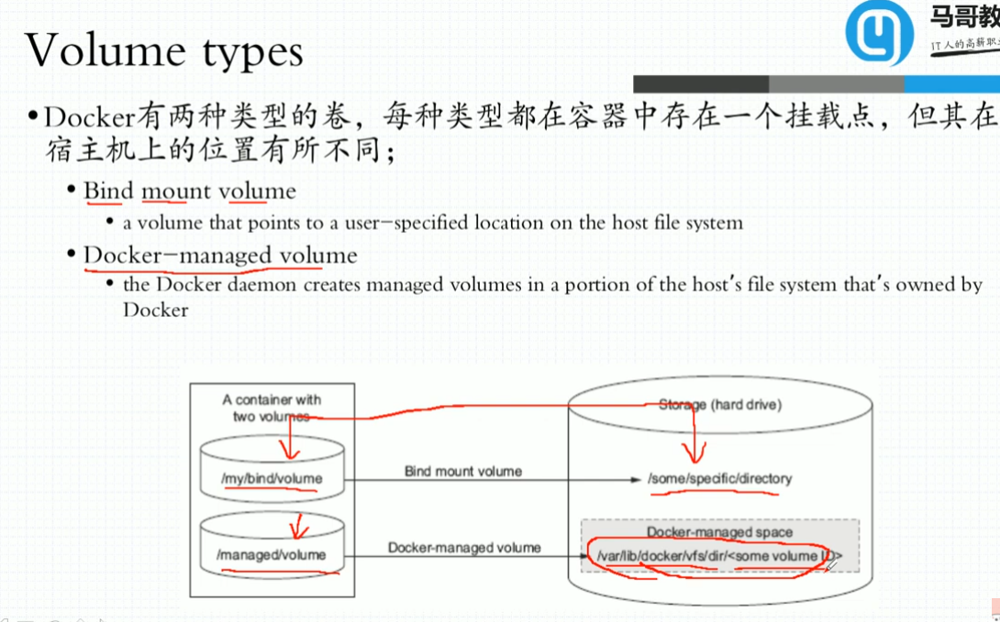

- docker管理的卷
  就是docker自己给你在宿主机创建一个目录，然后给你挂载进去，就跟一个共享文件夹一样。

- 绑定挂载的卷
  就是自己来指定宿主机的目录或者文件挂载到容器中。

容器可以共享存储卷。
