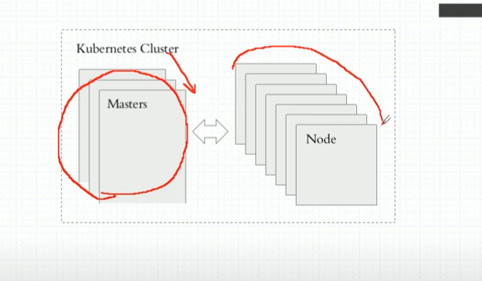

# kubernetes 使用教程

---

- *Docker三剑客* ：docker compose(单机),docker swarm(多个单机进行整合成一个集群的资源池), docker machine(将主机迅速初始化为一个可以加入docker swarm集群的工具)

- *mesos,marathon*：mesos(一个IDC的资源管理工具),marathon(面向容器的编排框架)

- *kubernetes*：逐渐垄断的一个容器编排工具。

---

## 一些概念

- DevOps(敏捷开发),MicroService(微服务，从单体到分层到微服务),Blockchain(区块链)

- CI: 持续集成

- CD: 持续交付，Delivery

- CD: 持续部署，Deployment

- 自动装箱，自我修复，水平扩展，服务发现，负载均衡，自动发布和回滚。

- 密钥和配置管理，存储编排，任务的批量处理运行。

- 整体架构：master/node

    

    master上面有一个API Server来接受请求
    master上面有个scheduler来调读具体在哪个node上面创建
    先做预选，然后在预选的结果中选择最佳的node

    node上面的kubelet来确保Node上面的Pod是否健康。

    master上面有控制器进行循环监控所有的Node的kubelet是否健康。

    master的控制器管理器来冗余保证监控健康。
