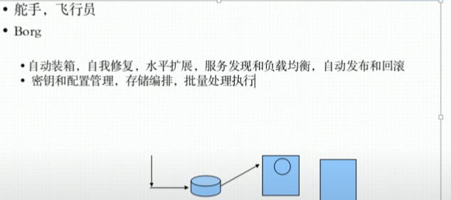
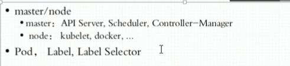
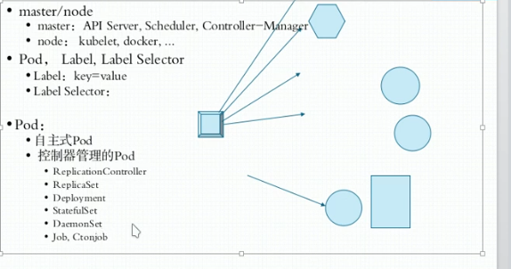
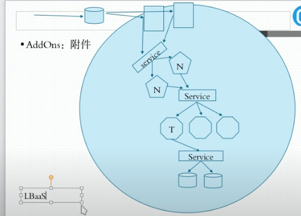
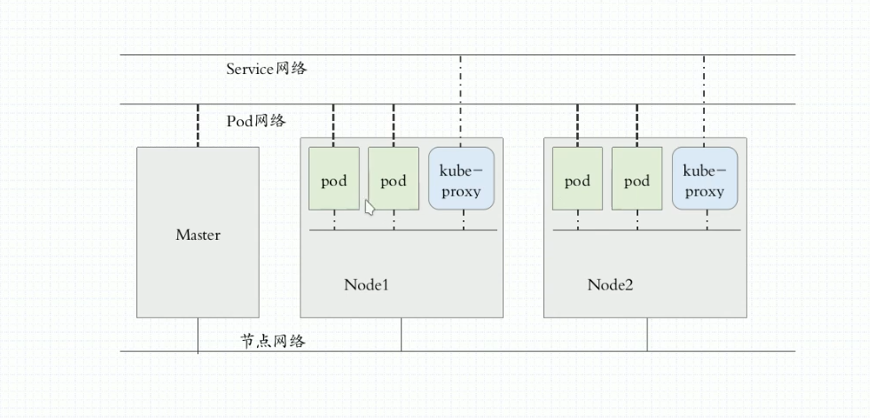
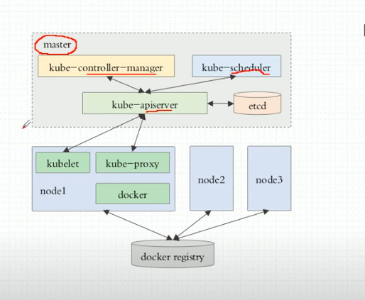
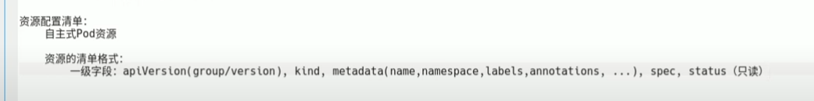
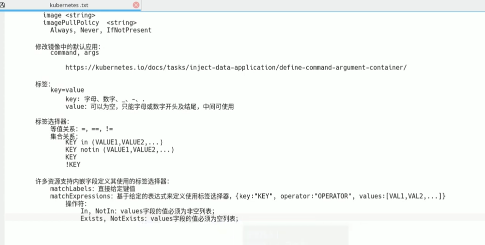
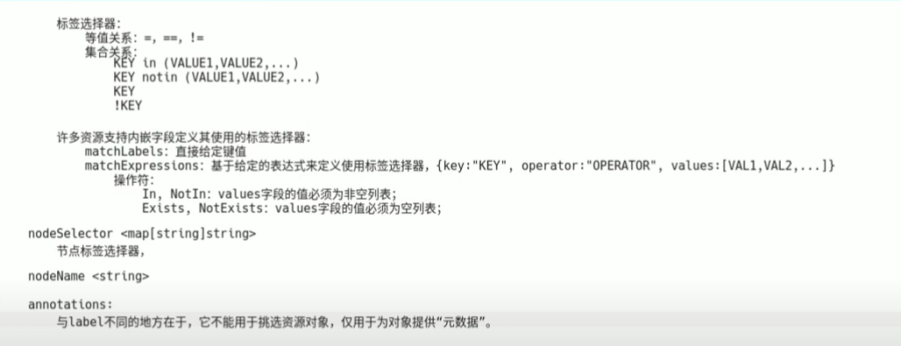
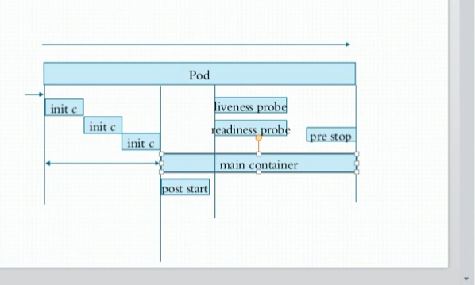

# kubernetes 使用教程

---

- *Docker三剑客* ：docker compose(单机),docker swarm(多个单机进行整合成一个集群的资源池), docker machine(将主机迅速初始化为一个可以加入docker swarm集群的工具)

- *mesos,marathon*：mesos(一个IDC的资源管理工具),marathon(面向容器的编排框架)

- *kubernetes*：逐渐垄断的一个容器编排工具。

---

## 一些概念

- DevOps(敏捷开发),MicroService(微服务，从单体到分层到微服务),Blockchain(区块链)

- CI: 持续集成

- CD: 持续交付，Delivery

- CD: 持续部署，Deployment

- 自动装箱，自我修复，水平扩展，服务发现，负载均衡，自动发布和回滚。

- 密钥和配置管理，存储编排，任务的批量处理运行。

- 整体架构：master/node

    

    master上面有一个API Server来接受请求
    master上面有个scheduler来调读具体在哪个node上面创建
    先做预选，然后在预选的结果中选择最佳的node

    node上面的kubelet来确保Node上面的Pod是否健康。

    master上面有控制器进行循环监控所有的Node的kubelet是否健康。

    master的控制器管理器来冗余保证监控健康。

- 支持的功能

    

- Pod

    k8s的原子单元，最小的可调度单位。

    Pod内的容器共享Net，共享存储卷，一个Pod如果放多个容器，大多数是有个主容器，其他的都是边车。

    

     node上还有一个kube-proxy

- HPA

    HorizontalPodAutoscaler 横向自动扩容

- service

    就是k8s设置的一个iptables的一个规则，后面生成的是ipvs规则

- AddOnes(附件)

    集群中的专用DNS服务，来发现服务

- NMT

    

同一Pod内的多个容器间通信:lo

各个Pod间通信：Overlay Network，隧道转发实现叠加网络

Pod与Service之间通信，Service是虚拟的网络，是主机中Iptables或者Ipvs规则中的地址，所以直接送往网关就行。

一旦Pod的地址发现地址改边，就直接用kube-proxy来修改宿主机的iptables或ipvs的规则。

k8s的master或者其他kube-proxy的数据放在etcd里面，所以etcd需要做高可用。

- CNI

    负责构建两层网络，Pod和容器网络。所有的cni需要提供自己的网络策略，也可以作为容器或者节点上的守护进程运行。

  - flannel:网络配置,就是一个纯粹的叠加网络

  - calico:网络配置，网络策略，三层隧道

  - canel

## kubeadm部署

首先把所有的机器上运行kubelet、kubeadm和docker,然后其他的组件都运行到Pod里面去，二进制部署的话都是用系统级的daemon进程来运行，这样的话就需要自己去维护所有的daemon进程服务，还需要cni来搞。

kubeadm就不需要，他运行为静态Pod，但是没有自身管理，也可以支持去管理。

apiserver仅接受JSON格式的资源定义;
yaml格式提供配置清单，apiserver可自动转为json格式，而后在提交;

大部分资源的配置清单（kubectl explain）：

    apiVersion: group/version `kubectl api-versions`
    
    kind: 资源类别

    metadata: 元数据

    name

    - namespace

    - labels

    - annotations
    
    spec: 期望状态,disired state

    status: 当前状态

Pod的生命周期

    状态: Pending 挂起 Running Faild Succeeded Unknown

    创建Pod:

        Pod生命周期中的重要行为：

        初始化容器

        容器探测

            liveness

            readiness

    restartPolicy:

        always,onfailure,never,default to always.