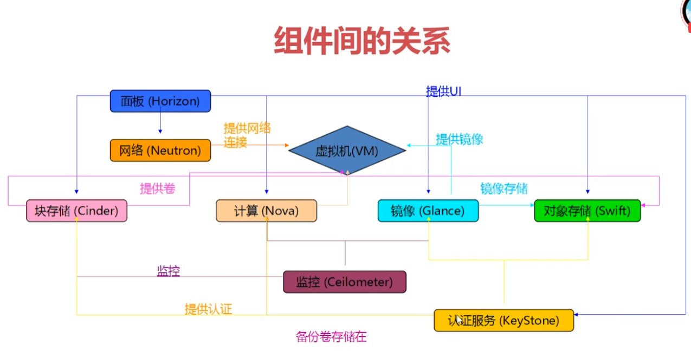

# OpenStack学习

---

整个OpenStack的组织关系如下图所示：

又这个图可以看出对于用户或者管理者来说控制界面由`Horizon`组件提供，是一个UI界面，然后通过`Neutron(网络组件)`来连接到整个`OpenStack`内部网络中进行访问。

`KeyStorn`一个提供认证和保存用户的账号的感觉一个组件,等比于`Kubernetes`里面的`Authentication`认证机制一样，不管是什么操作都会通过`KeyStorn`组件来拿一个会过期的*Token*，每次操作都要带上这个*Token*，每个组件都会与这个组件进行数据交互，来检查是否合法。

`Neutron`网络组件，是管理整个`OpenStack`里面的网络环境的一个组件，让整个`OpenStack`之间能够互相连通，也是用其他方式实现的。

`Clinder`块存储组件，这个是类似于`Kubernetes`里面的固定`Volunm`里面的一个存储控件，但是这个只能给虚拟机绑定使用的一个存储空间，不是为其他模块提供的，其他模块使用的存储是`Swift`组件。

`Nova`组件，计算组件，也就是整个`OpenStack`里面最核心的组件，负责对虚拟机进行管理等操作。

`Glance`组件，这个组件的功能相对而言较为简单，就是一个管理虚拟机的镜像的一个组件，每次需要创建虚拟机的时候，都会从这个组件中拉取对应的镜像然后进行装载等操作，它的存储组件是由`Swift`组件提供的。

`Swift`组件，这个组件的功能就是给整个`OpenStack`其他组件提供存储服务，一般而言就类似于一个管理其他分布式存储集群的一个统一接口那种感觉，比如管理`Ceph`之类的。

`Ceilometer`组件，这个组件用来监控`OpenStack`里面的搞组件的运行状态还有`Nova`组件的运行状态等。
