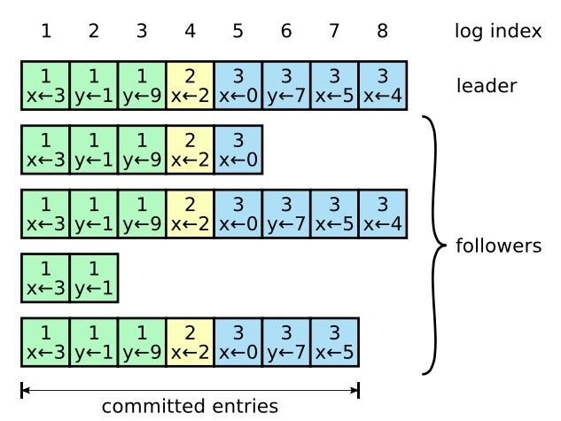
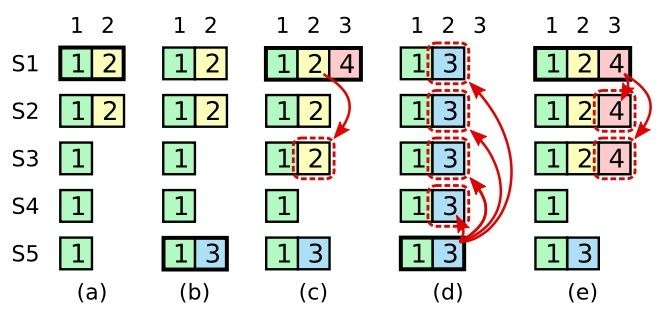
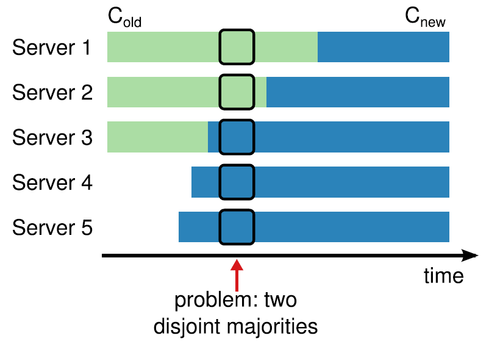
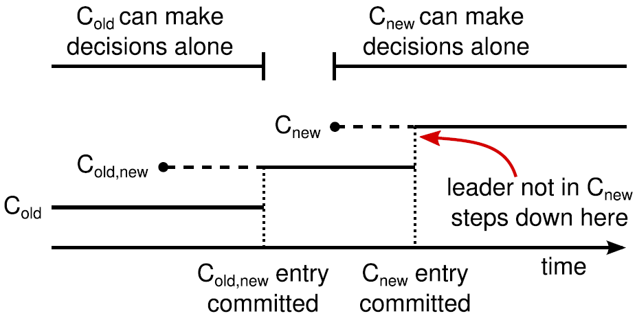

# 杂记

- ## galera集群

mysql 高可用

Active-Active架构 多主集群

同步复制 多线程复制 热备份

重启分为全量和增量复制库

原生mysql接口

每一次提交就是一个新的commit，有点类似于git，然后同步这个操作，如果所有节点都通过了这个认证尝试，就应用上去，如果没有就回滚，事务成功之后，是创建事务的节点对客户端回复成功认证

每个事务会有一个全局的事务序号，类似序列号一样的，在commit阶段就是把这个序列号的事务交给所有节点进行认证，认证通过才会commit

复制分为

- *State Snapshot Transfers (SST)* 全量复制，快照复制的感觉
- *Incremental State Transfers (IST)* 增量复制，比较相差的事务进行复制

***

- ## corosync+pacemaker 高可用集群

Corosync是一个实现HA(high Avaliable)心跳信息传输的一个软件，它可以通过一个简单的配置文件来定义信息传递的方式和协议等，实现节点间心跳传输服务。

pacemaker是一个开源的高可用资源管理器(CRM)，位于HA集群架构中资源管理、资源代理(RA)这个层次，它不能提供底层心跳信息传递的功能，要想与对方节点通信需要借助底层的心跳传递服务，将信息通告给对方。

***

- ## Quorum机制

分布式存储时使用的一种投票算法，用来保证数据冗余和最终一致性

在有冗余数据的分布式存储系统当中，冗余数据对象会在不同的机器之间存放多份拷贝。但是同一时刻一个数据对象的多份拷贝只能用于读或者用于写。

该算法可以保证同一份数据对象的多份拷贝不会被超过两个访问对象读写。

算法来源于[Gifford, 1979]。 分布式系统中的每一份数据拷贝对象都被赋予一票。每一个读操作获得的票数必须大于最小读票数（read quorum）（Vr），每个写操作获得的票数必须大于最小写票数（write quorum）(Vw）才能读或者写。如果系统有V票（意味着一个数据对象有V份冗余拷贝），那么最小读写票数(quorum)应满足如下限制：

Vr + Vw > V
Vw > V/2
第一条规则保证了一个数据不会被同时读写。当一个写操作请求过来的时候，它必须要获得Vw个冗余拷贝的许可。而剩下的数量是V-Vw 不够Vr，因此不能再有读请求过来了。同理，当读请求已经获得了Vr个冗余拷贝的许可时，写请求就无法获得许可了。

第二条规则保证了数据的串行化修改。一份数据的冗余拷贝不可能同时被两个写请求修改。

***

- ## 拜占庭将军问题

拜占庭将军问题（Byzantine Generals Problem），是由莱斯利·兰波特在其同名论文中提出的分布式对等网络通信容错问题。

在分布式计算中，不同的计算机通过通讯交换信息达成共识而按照同一套协作策略行动。但有时候，系统中的成员计算机可能出错而发送错误的信息，用于传递信息的通讯网络也可能导致信息损坏，使得网络中不同的成员关于全体协作的策略得出不同结论，从而破坏系统一致性。拜占庭将军问题被认为是容错性问题中最难的问题类型之一。

***

- ## Paxos

Paxos算法是莱斯利·兰伯特（英语：Leslie Lamport，LaTeX中的“La”）于1990年提出的一种基于消息传递且具有高度容错特性的共识（consensus）算法。

需要注意的是，Paxos常被误称为“一致性算法”。但是“一致性（consistency）”和“共识（consensus）”并不是同一个概念。Paxos是一个共识（consensus）算法。

Paxos算法只是一个共识算法

Paxos将系统中的角色分为提议者 (Proposer)，决策者 (Acceptor)，和最终决策学习者 (Learner)：

- *Proposer*: 提出提案 (Proposal)。Proposal信息包括提案编号 (Proposal ID) 和提议的值 (Value)。

- *Acceptor*: 参与决策，回应Proposers的提案。收到Proposal后可以接受提案，若Proposal获得多数Acceptors的接受，则称该Proposal被批准。

- *Learner*: 不参与决策，从Proposers/Acceptors学习最新达成一致的提案（Value）。

### 1. Basic Paxos

经典的 ***Paxos*** 算法，这个算法可以用来确单个值，也是最基础的 ***Paxos*** 算法，业务中多使用的是 ***Multi-Paxos***.

#### 1.1 Prepare(准备)阶段

此阶段是为了统一一个最大的提案提出。

*Proposer*提出议案N（议案编号）前，需要给至多数的*Acceptor*发送`Prepare(N)`请求。

*Acceptor*接收到*Proposer*发送的`Prepare(N)`之后进入一下流程：

1. 如果接受过N号提案，则返回之前接受的N号提案的内容。

2. 如果之前接受过的最大提案号M(记作M)大于N，则忽略N号提案，或者返回一个错误，表示不接受这个请求。

3. 如果之前接受过的最大提案号M(记作M)小于N，则将最大的提案号更新为N，且记录下N的提案，并且返回成功(Accept)。

```go
// Proposer

for _,acceptor := range MaxAcceptors {
  SendPrepare(N,proposalN)
}

// Acceptor
if proposal,ok := proposals[N];ok {
  return Reply(proposal)
}

if maxProposalNum > N {
  return Reply(ErrRecvOtherProposal)
} else {
  maxProposalNum = N
  proposals[N] = proposalN
  return Reply(AcceptProposalN)
}

```

#### 1.2 Propose(提交) -- Accept(确认)阶段 -- Learn(学习)阶段

此阶段是正式提出一个提案给大多数的*Acceptor*进行`Accept`请求，同时得到正式的`Accept`回复。

*Proposer* 在[prepare阶段####Prepare(准备)阶段)如果收到了大于自己提案号的已经被接受的提案则更新自己现有的提案，最后作为最终提案N(记做N)提出，向至多数(可与上阶段不同)的*Acceptor*正式发出`Accept(N)`请求。

*Acceptor* 在收到`Accept(N)`请求后会检查自己的最大的提案号，因为在[prepare阶段](####Prepare(准备)阶段)收到`Prepare(N)`请求的*Acceptor*已经承诺过不会再*ACCEPT*小于N的提案号的请求，如果大于或者等于自己的最大提案号则通知所有的*Learner*`ACCEPT_N`，当至多数的*Acceptor*`ACCEPT_N`之后，表明N号提案被确定了，*Learner*开始学习N号提案。

当一个提案被*Learner*学习后一个提案的流程正式结束，表明被采纳。

```go
// Proposer
for _,recvProposal := range Recv {
  if recvProposal.Err != nil { // 一般这种错误都是没有被接受或者什么的，自己做处理 伪代码
    continue
  }
  if recvProposal > N {
    N = recvProposal
    proposalN = recvProposal
  }
}

for _,acceptor range MaxAcceptors {
  SendPropose(N,proposalN)
}

// Acceptor
if maxProposalNum > N {
  Reply(ErrRecvMaxNum)
}
if maxProposalNum == N {
  for _,learner := range AllLearners {
    SendAccept(ACCEPT,N,proposalN)
  }
}

// Learner

count := recvAcceptProposal[N]
if count+1 > HalfNumOfAcceptor {
  Learn(N,proposalN)
} else {
  recvAcceptProposal[N] = count + 1
}

```

#### 1.3 编号生成

具体的提案编号的生成可以采取多种方式，比如用第三方服务来生成递增编号，或者用以下方式生成：

1. 质数算法：每个 proposer 对应着唯一的质数，每个新增议案，就是该质数的倍数。比如有两个 proposer 对应着 2，3 两个质数，第一个 proposer 提出第 i 个议案时，它的编号时 2 * i 。

2. 等差算法：假设有 n 个 proposer，那么第 m 个 proposer第 i 次新增的议案编号是 m + i * n 。

#### 1.4 参考

[[1] Paxos Made Simple](https://lamport.azurewebsites.net/pubs/paxos-simple.pdf)

[[2] 一个Paxos的讲解](https://zhmin.github.io/2019/09/11/paxos/)

[[3] wiki](https://zh.wikipedia.org/zh/Paxos%E7%AE%97%E6%B3%95)

### 2. Multi-Paxos算法

兰伯特提到的*Multi-Paxos*是一种思想，不是算法。而*Multi-Paxos*算法是一个统称，它是指基于*Multi-Paxos*思想，通过多个*Basic Paxos*实例实现一系列值的共识的算法（比如 *Chubby* 的 *Multi-Paxos* 实现、*Raft* 算法等）

***

- ## Raft

*Raft*是一种用于替代[Paxos](##Paxos)的共识算法。

*Raft*通过*Leader*来确定所有的日志同步，每个*Leader*存在一个任期(*Term*)，在任期内的*Leader*负责来同步所有的日志，并且将日志的提交号递增，日志复制的过程就是一个大多数确认的过程，可以理解成每个日志都是一个*Paxos*算法中单一*Proposer*提出的一个提案，然后当至多数的从节点(*Paxos*中的*Acceptor*)确认后，同步到所有从节点，表明学习了(*Paxos*中的*Learning*阶段)。

这样做的好处就是吧*Paxos*的单一提案的决策给应用到每一次的日志提交中，同时简化多*Proposer*的过程，避免活锁出现，单一*Proposer*能够更加简单的实现，在每一个任期中，每一个节点的身份会少于*Paxos*的三个状态。

*Raft*分为几个问题来解决，一个是领导选举(*Leader Selector*)、一个是日志复制(*Log Replication*)、一个是安全(*Safety*)、一个是成员变化(*Membership changes*)

*Raft*节点分为以下几个状态

1. *Leader*：接受客户端请求，并向*Follower*同步请求日志，当日志同步到大多数节点上后告诉*Follower*提交日志。

2. *Follower*：接受并持久化*Leader*同步的日志，在*Leader*告之日志可以提交之后，提交日志。

3. *Candidate*：*Leader*选举过程中的临时角色。


### 领导选举(*Leader Selector*)

领导选举是*Raft*为了实现单一提出者而提出的问题，为了保证每次日志复制的时候只有单一*Leader*存在，*Raft*使用了任期(*Term*)概念，当*Leader*存在时，*Leader*会周期性的朝所有的*Follower*发送*Heartbeat*，通过*Heartbeat*来确认任期和*Leader*，如果当*Follower*在一段时间内没有收到*Heartbeat*，那么这个*Follower*节点就将当前的任期(*Term*)加一，然后转化成*Candidate*身份来发起选举，这个*Candidate*会首先给自己投上一票，然后再广播消息，给集群中所有的节点发送`RequestVote_RPC`消息，其他节点收到这个消息后会根据不同的情况进行回复，*Candidate*就会根据所有节点的回复来判断，是否当选等三种情况：

1. 至多数的*Follower*回复，赢得了多数选票，成功选举成为了*Leader*
2. 收到了来自上一个任期*Term*中的*Leader*的消息，或其他*Candidate*选举成功成为的*Leader*的消息，选举失败，自动转为*Follower*
3. 没有赢得至多数的选票，等待下一个超时时间发起选举

### 日志复制(*Log Replication*)

对于客户端的请求的操作，*Leader*将这种请求作为一个日志的条目(*Log Entries*)加入到自己节点保存的日志中，然后向所有的节点进行同步，发起`AppendEntries_RPC`消息，当至多数*Follower*已经成功复制了这条日志的时候，*Leader*才会将这条日志应用到自己的状态机上面，并且向客户端回复，这样就是等同于*Paxos*的一个提案的完整流程。

某些*Followers*可能没有成功的复制日志，*Leader*会无限的重试`AppendEntries_RPC`直到所有的*Followers*最终存储了所有的日志条目。

每个日志(*Log Entries*)都有自己的序号(*Index*)，且这个序号(*Index*)是递增的，然后每个日志(*Log Entries*)中的内容包含了自己的任期号(*Term*)和具体的操作(*operation*)，当一个日志(*Log Entries*)被复制到至多数的节点(*Follower*)上的时候就可以认为是提交(*Commit*)了,这个时候*Leader*就会把这个操作(*operation*)给应用到自己的状态机上。



*Raft*日志同步保证如下两点：

1. 如果不同日志中的两个条目有着相同的索引和任期号，则它们所存储的命令是相同的。
2. 如果不同日志中的两个条目有着相同的索引和任期号，则它们之前的所有条目都是完全一样的。

第一条特性源于*Leader*在一个*Term*内在给定的一个*log index*最多创建一条日志条目，同时该条目在日志中的位置也从来不会改变。

第二条特性源于 *AppendEntries* 的一个简单的一致性检查。当发送一个 *AppendEntries_RPC* 时，*Leader*会把新日志条目紧接着之前的条目的*log index*和*Term*都包含在里面。如果*Follower*没有在它的日志中找到*log index*和*Term*都相同的日志，它就会拒绝新的日志条目。

一般情况下，*Leader*和*Followers*的日志保持一致，因此 *AppendEntries* 一致性检查通常不会失败。然而，*Leader*崩溃可能会导致日志不一致：旧的*Leader*可能没有完全复制完日志中的所有条目。

如果出现了*Follower*的日志和新的*Leader*的日志不一样的时候就会强制复制，从后向前找到一致的，然后进行拷贝。

### 安全(*Safety*)

*Raft*增加了如下两条限制以保证安全性：

1. 拥有最新的已提交(*Commit*)的日志(*Log Entrie*)的*Follower*才能有资格成为*Leader*

    这个就是在每个*Follower*变成*Candidate*后向所有的*Follower*发起`RequestVote_RPC`消息时，每个*Follower*收到消息后进行检查的检查结果。

    每个`RequestVote_RPC`消息必须带上自己的最后一条日志(*Log entrie*)的序号(*Index*)和任期号(*Term*)，收到消息的*Follower*将对这个进行检查，如果自己的日志(*Log Entrie*)比请求中的大，则拒绝请求。

    比较规则是：

    term大则大
    term一样比较index，index大则大

    大致代码如下：

    ```go
    RequestVoteRPCCallBack(term,index int) bool {
      if self.MaxTerm > term {
        return false
      } else if self.MaxTerm == term {
        if self.MaxIndex > index {
          return false
        }
      }
      return true
    }
    ```
  
2. *Leader* 只能推进*commit index*来提交当前*term*的已经复制到大多数服务器上的日志，旧*term*日志的提交要等到提交当前*term*的日志来间接提交（*log index* 小于 *commit index*的日志被间接提交）。

之所以要这样，是因为可能会出现已提交的日志又被覆盖的情况：



在阶段a，term为2，S1是Leader，且S1写入日志（term, index）为(2, 2)，并且日志被同步写入了S2；

在阶段b，S1离线，触发一次新的选主，此时S5被选为新的Leader，此时系统term为3，且写入了日志（term, index）为（3， 2）;

S5尚未将日志推送到Followers就离线了，进而触发了一次新的选主，而之前离线的S1经过重新上线后被选中变成Leader，此时系统term为4，此时S1会将自己的日志同步到Followers，按照上图就是将日志（2， 2）同步到了S3，而此时由于该日志已经被同步到了多数节点（S1, S2, S3），因此，此时日志（2，2）可以被提交了。；

在阶段d，S1又下线了，触发一次选主，而S5有可能被选为新的Leader（这是因为S5可以满足作为主的一切条件：1. term = 5 > 4，2. 最新的日志为（3，2），比大多数节点（如S2/S3/S4的日志都新），然后S5会将自己的日志更新到Followers，于是S2、S3中已经被提交的日志（2，2）被截断了。

增加上述限制后，即使日志（2，2）已经被大多数节点（S1、S2、S3）确认了，但是它不能被提交，因为它是来自之前term（2）的日志，直到S1在当前term（4）产生的日志（4， 4）被大多数Followers确认，S1方可提交日志（4，4）这条日志，当然，根据Raft定义，（4，4）之前的所有日志也会被提交。此时即使S1再下线，重新选主时S5不可能成为Leader，因为它没有包含大多数节点已经拥有的日志（4，4）。

这一段理解起来有点绕，不过这个情况出现只能是在还没有提交完成的时候出现了leader掉线的情况，暂时不知道怎么去概括就直接复制的。

### 成员变化(*Membership changes*)

这个就是当集群中有节点掉线或者新节点加入时的情况，因为节点变更或者节点替换会导致新旧节点产生不一致的日志，就需要进行处理：

如果当前*Leader*存在，这是最理想的情况，直接进行覆盖复制，将新节点同步到跟*Leader*一致的情况。

主要是考虑当*Leader*离线或者其他更加复杂的情况：

成员变更也是一个分布式一致性问题，既所有服务器对新成员达成一致。但是成员变更又有其特殊性，因为在成员变更的一致性达成的过程中，参与投票的进程会发生变化。

如果将成员变更当成一般的一致性问题，直接向Leader发送成员变更请求，Leader复制成员变更日志，达成多数派之后提交，各服务器提交成员变更日志后从旧成员配置（Cold）切换到新成员配置（Cnew）。

因为各个服务器提交成员变更日志的时刻可能不同，造成各个服务器从旧成员配置（Cold）切换到新成员配置（Cnew）的时刻不同。

成员变更不能影响服务的可用性，但是成员变更过程的某一时刻，可能出现在Cold和Cnew中同时存在两个不相交的多数派，进而可能选出两个Leader，形成不同的决议，破坏安全性。



由于成员变更的这一特殊性，成员变更不能当成一般的一致性问题去解决。

为了解决这一问题，Raft提出了两阶段的成员变更方法。集群先从旧成员配置Cold切换到一个过渡成员配置，称为共同一致（joint consensus），共同一致是旧成员配置Cold和新成员配置Cnew的组合Cold U Cnew，一旦共同一致Cold U Cnew被提交，系统再切换到新成员配置Cnew。



Raft两阶段成员变更过程如下：

1. Leader收到成员变更请求从Cold切成Cnew；
2. Leader在本地生成一个新的log entry，其内容是Cold∪Cnew，代表当前时刻新旧成员配置共存，写入本地日志，同时将该log entry复制至Cold∪Cnew中的所有副本。在此之后新的日志同步需要保证得到Cold和Cnew两个多数派的确认；
Follower收到Cold∪Cnew的log entry后更新本地日志，并且此时就以该配置作为自己的成员配置；
如果Cold和Cnew中的两个多数派确认了Cold U Cnew这条日志，Leader就提交这条log entry；
接下来Leader生成一条新的log entry，其内容是新成员配置Cnew，同样将该log entry写入本地日志，同时复制到Follower上；
Follower收到新成员配置Cnew后，将其写入日志，并且从此刻起，就以该配置作为自己的成员配置，并且如果发现自己不在Cnew这个成员配置中会自动退出；
Leader收到Cnew的多数派确认后，表示成员变更成功，后续的日志只要得到Cnew多数派确认即可。Leader给客户端回复成员变更执行成功。
异常分析：

- 如果Leader的Cold U Cnew尚未推送到Follower，Leader就挂了，此后选出的新Leader并不包含这条日志，此时新Leader依然使用Cold作为自己的成员配置。
- 如果Leader的Cold U Cnew推送到大部分的Follower后就挂了，此后选出的新Leader可能是Cold也可能是Cnew中的某个Follower。
- 如果Leader在推送Cnew配置的过程中挂了，那么同样，新选出来的Leader可能是Cold也可能是Cnew中的某一个，此后客户端继续执行一次改变配置的命令即可。
- 如果大多数的Follower确认了Cnew这个消息后，那么接下来即使Leader挂了，新选出来的Leader肯定位于Cnew中。
- 两阶段成员变更比较通用且容易理解，但是实现比较复杂，同时两阶段的变更协议也会在一定程度上影响变更过程中的服务可用性，因此我们期望增强成员变更的限制，以简化操作流程。

两阶段成员变更，之所以分为两个阶段，是因为对Cold与Cnew的关系没有做任何假设，为了避免Cold和Cnew各自形成不相交的多数派选出两个Leader，才引入了两阶段方案。

如果增强成员变更的限制，假设Cold与Cnew任意的多数派交集不为空，这两个成员配置就无法各自形成多数派，那么成员变更方案就可能简化为一阶段。

那么如何限制Cold与Cnew，使之任意的多数派交集不为空呢？方法就是每次成员变更只允许增加或删除一个成员。

可从数学上严格证明，只要每次只允许增加或删除一个成员，Cold与Cnew不可能形成两个不相交的多数派。

一阶段成员变更：

- 成员变更限制每次只能增加或删除一个成员（如果要变更多个成员，连续变更多次）。
- 成员变更由Leader发起，Cnew得到多数派确认后，返回客户端成员变更成功。
- 一次成员变更成功前不允许开始下一次成员变更，因此新任Leader在开始提供服务前要将自己本地保存的最新成员配置重新投票形成多数派确认。
- Leader只要开始同步新成员配置，即可开始使用新的成员配置进行日志同步。


***

- ## 名词翻译

  - RoundRobin: 轮询
