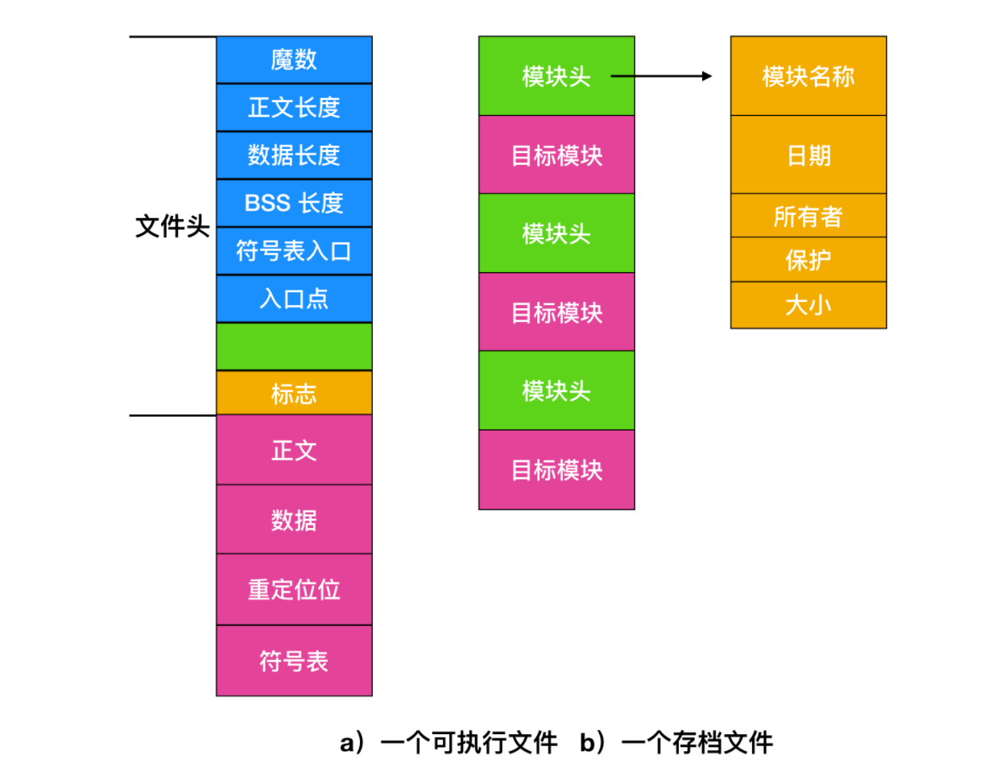
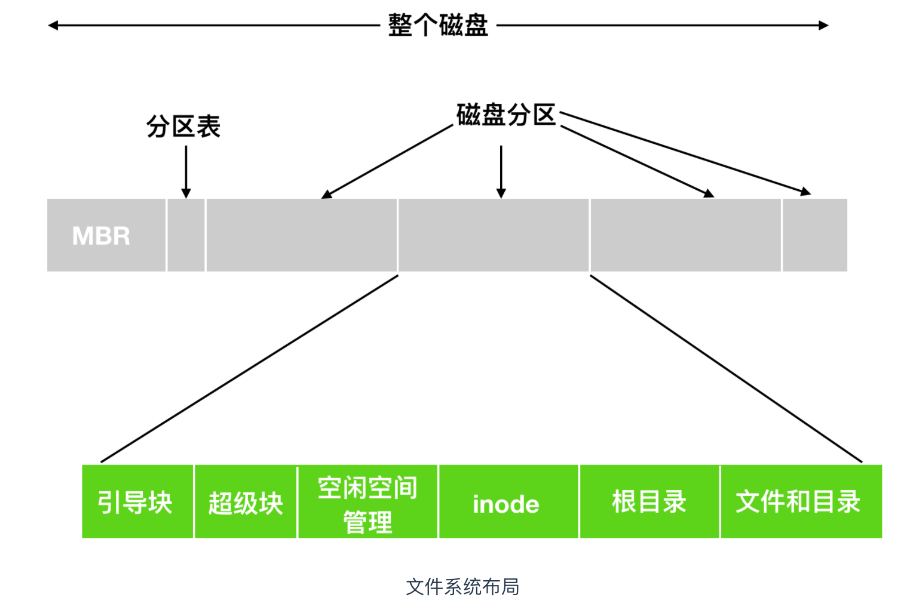
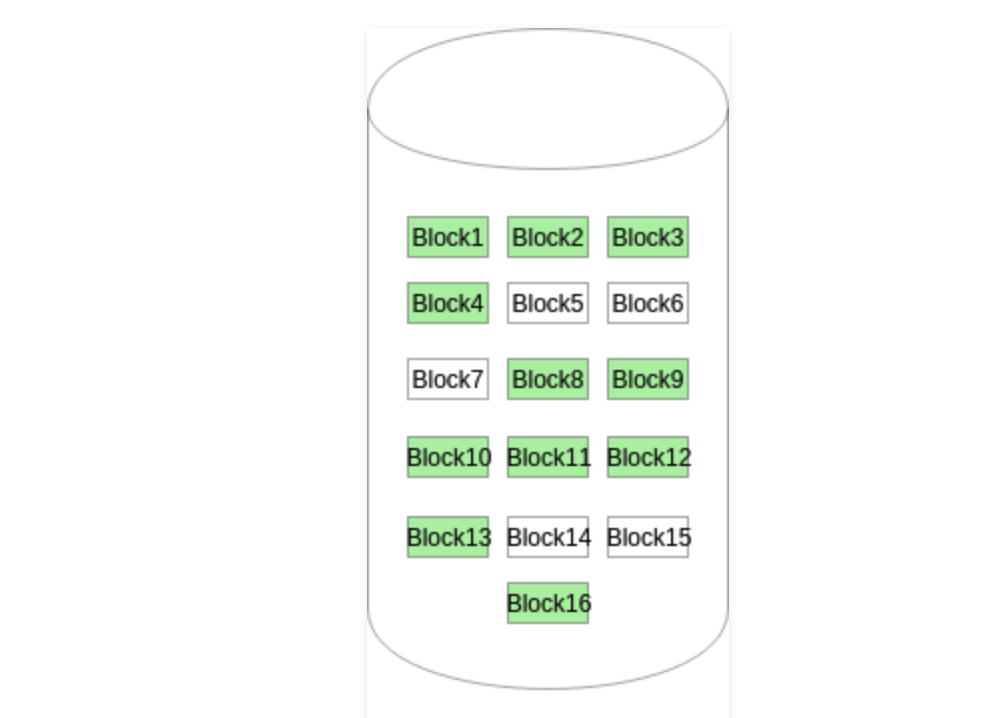
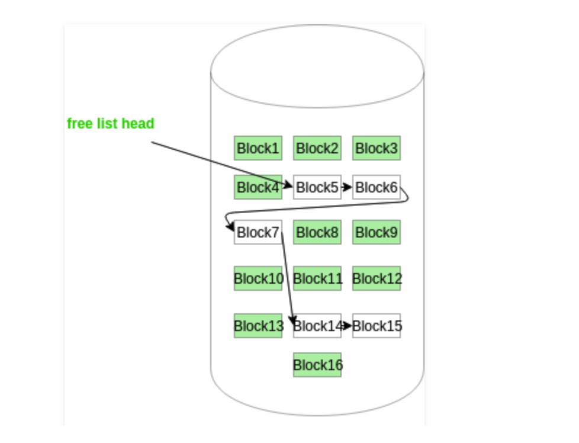
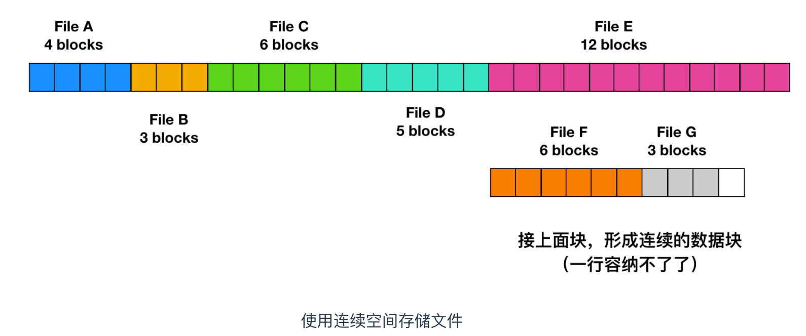
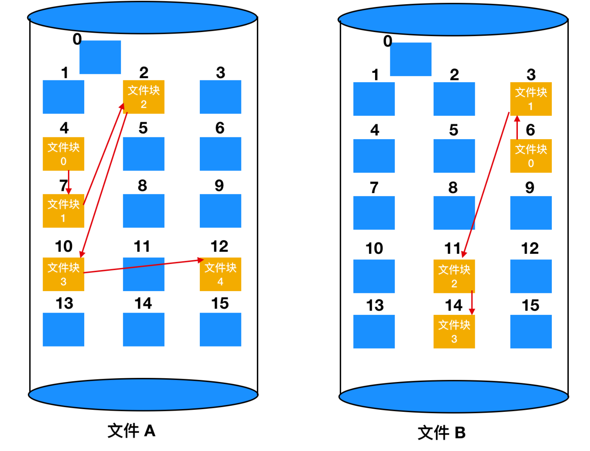
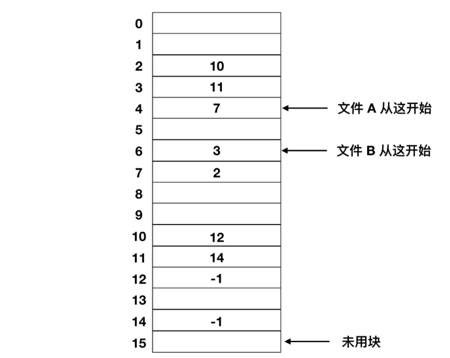
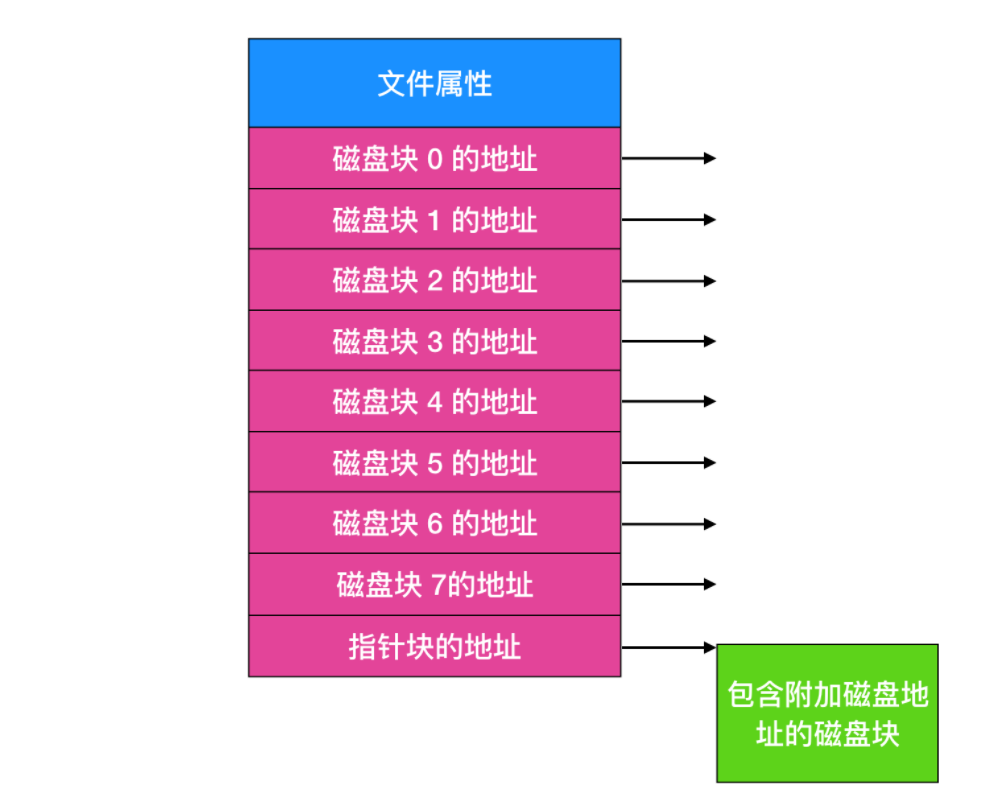

# 文件系统

本文摘抄自cnblog cxuan的[文件系统](https://www.cnblogs.com/cxuanBlog/p/12565601.html)

---

文件是硬盘块上的一种抽象概念，通过抽象来表明一块硬盘快所存储的数据，所以文件其实就是一个磁盘块的地址空间的一个抽象描述，类似于一个固定的结构体，表明了这个磁盘块的开头和大小还有具体的对齐格式等。

最基础的两种文件系统就是

1. UNIX
2. MS-DOS

对于MS-DOS文件系统在更新的windos系统上的名称叫做*FAT-16*，win98对其进行了一部分的扩展所以叫做*FAT-32*，在更新的Win操作系统中都对此文件系统支持。win上更新的文件系统为*NTFS(本机文件系统)*，win8上面还有一种其他的文件系统叫做*ReFS(Resilient File System)*，还有一种新型的FAT文件系统叫做*exFAT*，这种文件系统是针对于闪存，或者大文件西统开发的一种优化于FAT-32的文件系统，*exFAT*满足*OS X*读写的。

## 文件结构

文件结构有多种方式。常用的如下图：

不同的文件格式读写方式不同，unix和win系统均使用a方式进行排序。

## 文件类型

很多操作系统支持多种文件类型。例如，UNIX（同样包括 OS X）和 Windows 都具有常规的文件和目录。除此之外，UNIX 还具有字符特殊文件(character special file) 和 块特殊文件(block special file)。常规文件(Regular files) 是包含有用户信息的文件。用户一般使用的文件大都是常规文件，常规文件一般包括 可执行文件、文本文件、图像文件，从常规文件读取数据或将数据写入时，内核会根据文件系统的规则执行操作，是写入可能被延迟，记录日志或者接受其他操作。

字符特殊文件和输入/输出有关，用于串行 I/O 类设备，如终端、打印机、网络等。块特殊文件用于磁盘类设备。我们主要讨论的是常规文件。

常规文件一般分为 ASCII 码文件或者二进制文件。ASCII 码文件由文本组成。在一些系统中，每行都会用回车符结束（ASCII码是13，控制字符 CR，转义字符\r。），另外一些则会使用换行符（ASCII码是10，控制字符LF，转义字符\n）。一些系统（比如 Windows）两者都会使用。

ASCII 文件的优点在于显示 和 打印，还可以用任何文本编辑器进行编辑。进一步来说，如果许多应用程序使用 ASCII 码作为输入和输出，那么很容易就能够把多个程序连接起来，一个程序的输出可能是另一个程序的输入，就像管道一样。

其他与 ASCII 不同的是二进制文件。打印出来的二进制文件是无法理解的。下面是一个二进制文件的格式，它取自早期的 UNIX 。尽管从技术上来看这个文件只是字节序列，但是操作系统只有在文件格式正确的情况下才会执行。

- 块设备
   也叫做块特殊文件，它的行为通常与普通文件相似：它们是字节数组，并且在给定位置读取的值是最后写入该位置的值。来自块设备的数据可以缓存在内存中，并从缓存中读取；写入可以被缓冲。块设备通常是可搜索的，块设备的概念是，相应的硬件可以一次读取或者写入整个块，例如磁盘上的一个扇区
- 字符设备
   也称为字符特殊文件，它的行为类似于管道、串行端口。将字节写入字符设备可能会导致它在屏幕上显示，在串行端口上输出，转换为声音。

## 文件访问

早期的操作系统只有一种访问方式：序列访问(sequential access)。在这些系统中，进程可以按照顺序读取所有的字节或文件中的记录，但是不能跳过并乱序执行它们。顺序访问文件是可以返回到起点的，需要时可以多次读取该文件。当存储介质是磁带而不是磁盘时，顺序访问文件很方便。

在使用磁盘来存储文件时，可以不按照顺序读取文件中的字节或者记录，或者按照关键字而不是位置来访问记录。这种能够以任意次序进行读取的称为随机访问文件(random access file)。许多应用程序都需要这种方式。

随机访问文件对许多应用程序来说都必不可少，例如，数据库系统。如果乘客打电话预定某航班机票，订票程序必须能够直接访问航班记录，而不必先读取其他航班的成千上万条记录。

有两种方法可以指示从何处开始读取文件。第一种方法是直接使用 read 从头开始读取。另一种是用一个特殊的 seek 操作设置当前位置，在 seek 操作后，从这个当前位置顺序地开始读文件。UNIX 和 Windows 使用的是后面一种方式。

## 文件系统的实现

这部分是重点内容，上面其实都是对整个文件系统的一个介绍，知道文件系统是什么东西，有什么用途。

### 文件系统布局

文件系统存储在磁盘中。大部分的磁盘能够划分出一到多个分区，叫做磁盘分区(disk partitioning) 或者是磁盘分片(disk slicing)。每个分区都有独立的文件系统，每块分区的文件系统可以不同。磁盘的 0 号分区称为 主引导记录(Master Boot Record, MBR)，用来引导(boot) 计算机。在 MBR 的结尾是分区表(partition table)。每个分区表给出每个分区由开始到结束的地址。系统管理员使用一个称为分区编辑器的程序来创建，调整大小，删除和操作分区。这种方式的一个缺点是很难适当调整分区的大小，导致一个分区具有很多可用空间，而另一个分区几乎完全被分配。

MBR 可以用在 DOS 、Microsoft Windows 和 Linux 操作系统中。从 2010 年代中期开始，大多数新计算机都改用 GUID 分区表（GPT）分区方案。

当计算机开始引 boot 时，BIOS 读入并执行 MBR。

### 引导块

MBR 做的第一件事就是确定活动分区，读入它的第一个块，称为引导块(boot block) 并执行。引导块中的程序将加载分区中的操作系统。为了一致性，每个分区都会从引导块开始，即使引导块不包含操作系统。引导块占据文件系统的前 4096 个字节，从磁盘上的字节偏移量 0 开始。引导块可用于启动操作系统。

在计算机中，引导就是启动计算机的过程，它可以通过硬件（例如按下电源按钮）或者软件命令的方式来启动。开机后，电脑的 CPU 还不能执行指令，因为此时没有软件在主存中，所以一些软件必须先被加载到内存中，然后才能让 CPU 开始执行。也就是计算机开机后，首先会进行软件的装载过程。

重启电脑的过程称为重新引导(rebooting)，从休眠或睡眠状态返回计算机的过程不涉及启动。

除了从引导块开始之外，磁盘分区的布局是随着文件系统的不同而变化的。通常文件系统会包含一些属性，如下：

### 超级块

紧跟在引导块后面的是 超级块(Superblock)，超级块 的大小为 4096 字节，从磁盘上的字节偏移 4096 开始。超级块包含文件系统的所有关键参数

- 文件系统的大小
- 文件系统中的数据块数
- 指示文件系统状态的标志
- 分配组大小

在计算机启动或者文件系统首次使用时，超级块会被读入内存。

### 空闲空间块

接着是文件系统中空闲块的信息，例如，可以用位图或者指针列表的形式给出。

- BitMap 位图或者 Bit vector 位向量

  位图或位向量是一系列位或位的集合，其中每个位对应一个磁盘块，该位可以采用两个值：0和1，0表示已分配该块，而1表示一个空闲块。下图中的磁盘上给定的磁盘块实例（分配了绿色块）可以用16位的位图表示为：0000111000000110。
  
  我自己理解就是用多少位的二进制来表示具体的磁盘块的状态。图如下：

  

- 链表
  
  在这种方法中，空闲磁盘块链接在一起，即一个空闲块包含指向下一个空闲块的指针。第一个磁盘块的块号存储在磁盘上的单独位置，也缓存在内存中。
  
  

### 碎片

这里不得不提一个叫做碎片(fragment)的概念，也称为片段。一般零散的单个数据通常称为片段。 磁盘块可以进一步分为固定大小的分配单元，片段只是在驱动器上彼此不相邻的文件片段。如果你不理解这个概念就给你举个例子。比如你用 Windows 电脑创建了一个文件，你会发现这个文件可以存储在任何地方，比如存在桌面上，存在磁盘中的文件夹中或者其他地方。你可以打开文件，编辑文件，删除文件等等。你可能以为这些都在一个地方发生，但是实际上并不是，你的硬盘驱动器可能会将文件中的一部分存储在一个区域内，另一部分存储在另外一个区域，在你打开文件时，硬盘驱动器会迅速的将文件的所有部分汇总在一起，以便其他计算机系统可以使用它。

### inode

然后在后面是一个 inode(index node)，也称作索引节点。它是一个数组的结构，每个文件有一个 inode，inode 非常重要，它说明了文件的方方面面。每个索引节点都存储对象数据的属性和磁盘块位置

inode 节点主要包括了以下信息

- 模式/权限（保护）
- 所有者 ID
- 组 ID
- 文件大小
- 文件的硬链接数
- 上次访问时间
- 最后修改时间
- inode 上次修改时间

文件分为两部分，索引节点和块。一旦创建后，每种类型的块数是固定的。你不能增加分区上 inode 的数量，也不能增加磁盘块的数量。

紧跟在 inode 后面的是根目录，它存放的是文件系统目录树的根部。最后，磁盘的其他部分存放了其他所有的目录和文件。

## 文件的实现

最重要的问题是记录各个文件分别用到了哪些磁盘块。不同的系统采用了不同的方法。下面我们会探讨一下这些方式。分配背后的主要思想是有效利用文件空间和快速访问文件 ，主要有三种分配方案

- 连续分配
- 链表分配
- 索引分配

### 连续分配

这种分配方式最简单，但是没法充分利用磁盘空间，磁盘中的块空间可能存放了部分数据，但是就被占用了，所以一个文件最小的大小就是一个磁盘块的大小。

但是相应的，文件如果被删除后，占用的块也会被删除，文件系统并不会把后面的块给挤压到前面空闲块中，所以如果后面的文件没有那么多的连续块存储的话就会导致容量看着充足，但是全是碎片化的细小块，无法存储。

### 链表分配

在链表的分配方案中，尽管顺序读取非常方便，但是随机访问却很困难（这也是数组和链表数据结构的一大区别）。

还有一个问题是，由于指针会占用一些字节，每个磁盘块实际存储数据的字节数并不再是 2 的整数次幂。虽然这个问题并不会很严重，但是这种方式降低了程序运行效率。许多程序都是以长度为 2 的整数次幂来读写磁盘，由于每个块的前几个字节被指针所使用，所以要读出一个完成的块大小信息，就需要当前块的信息和下一块的信息拼凑而成，因此就引发了查找和拼接的开销。

### 使用内存表进行链表分配

内存中的这种表格称为 文件分配表(File Application Table,FAT)。

这种方式存在缺点，那就是必须要把整个链表放在内存中。对于 1TB 的磁盘和 1KB 的大小的块，那么这张表需要有 10 亿项。。。每一项对应于这 10 亿个磁盘块中的一块。每项至少 3 个字节，为了提高查找速度，有时需要 4 个字节。根据系统对空间或时间的优化方案，这张表要占用 3GB 或 2.4GB 的内存。FAT 的管理方式不能较好地扩展并应用于大型磁盘中。而这正是最初 MS-DOS 文件比较实用，并仍被各个 Windows 版本所安全支持。

### inode

最后一个记录各个文件分别包含哪些磁盘块的方法是给每个文件赋予一个称为 inode(索引节点) 的数据结构，每个文件都与一个 inode 进行关联，inode 由整数进行标识。

下面是一个简单例子的描述。

给出 inode 的长度，就能够找到文件中的所有块。

相对于在内存中使用表的方式而言，这种机制具有很大的优势。即只有在文件打开时，其 inode 才会在内存中。如果每个 inode 需要 n 个字节，最多 k 个文件同时打开，那么 inode 占有总共打开的文件是 kn 字节。仅需预留这么多空间。

这个数组要比我们上面描述的 FAT(文件分配表) 占用的空间小的多。原因是用于保存所有磁盘块的链接列表的表的大小与磁盘本身成正比。如果磁盘有 n 个块，那么这个表也需要 n 项。随着磁盘空间的变大，那么该表也随之线性增长。相反，inode 需要节点中的数组，其大小和可能需要打开的最大文件个数成正比。它与磁盘是 100GB、4000GB 还是 10000GB 无关。

inode 的一个问题是如果每个节点都会有固定大小的磁盘地址，那么文件增长到所能允许的最大容量外会发生什么？一个解决方案是最后一个磁盘地址不指向数据块，而是指向一个包含额外磁盘块地址的地址，如上图所示。一个更高级的解决方案是：有两个或者更多包含磁盘地址的块，或者指向其他存放地址的磁盘块的磁盘块。Windows 的 NTFS 文件系统采用了相似的方法，所不同的仅仅是大的 inode 也可以表示小的文件。

NTFS 的全称是 New Technology File System，是微软公司开发的专用系统文件，NTFS 取代 FAT(文件分配表) 和 HPFS(高性能文件系统) ，并在此基础上进一步改进。例如增强对元数据的支持，使用更高级的数据结构以提升性能、可靠性和磁盘空间利用率等。

